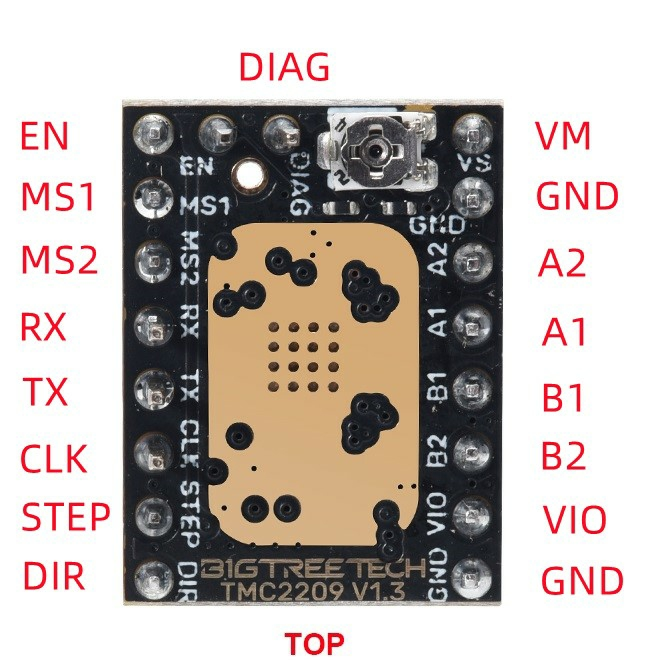
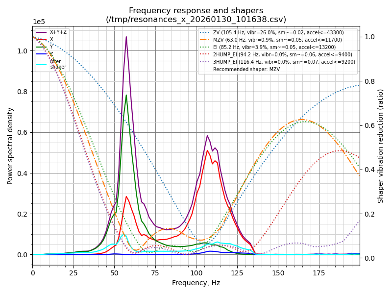
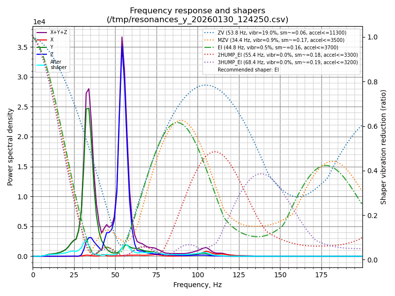

# Artillery Sidewinder X2 - Klipper Configuration (TMC2209 Mod)

This repository contains my personal Klipper configuration for the **Artillery Sidewinder X2**. 

**Note:** This configuration is specifically tuned for a printer that has been upgraded with **TMC2209 stepper drivers**. If you are using the stock drivers, you will need to adjust the current and pin settings, as well as disable UART.

I have also connected the drivers via UART for advanced control and monitoring.

## Features
- **Stepper Drivers:** Configured for TMC2209 (Silent & Cool operation).
- **Input Shaper:** Pre-configured and tuned via an ADXL345 accelerometer to eliminate ringing/ghosting at high speeds.
- **Bed Leveling:** Optimized Bed Mesh and Screws Tilt Adjust.
- **Macros:** Includes standard Start/End G-code, Pause/Resume, and Filament Change (M600).
- **Pressure Advance:** Calibrated for the stock extruder.
- **KAMP (Klipper-Adaptive-Mesh-Purging):** Enabled for faster and better first layers.

## Hardware Specifications
- **Printer:** Artillery Sidewinder X2
- **Mainboard:** Stock Ruby v1.2
- **Drivers:** 
  - 2x TMC2209 for X and Y axes (connected via UART).
  - Z-axis and Extruder use the stock FS31W01 drivers (a TMC2100 clone) in series.
- **Host Computer:** Orange Pi 3B running Ubuntu Server 22.04 LTS (Running stable for over a year).
- **Firmware:** Klipper

> 🚀 **Performance:** In my setup, the maximum stable printing speed achieved is around **210 mm/s** with an acceleration of **4000-5000 mm/s²**.

---

## TMC2209 UART Wiring & Hardware Mod

To enable UART for the TMC2209 drivers, you need to connect the **RX pin** of the driver to one of the free pins on the **EXT1** port of the Ruby mainboard. 
- **X-Axis Driver RX:** Connected to **PB4**
- **Y-Axis Driver RX:** Connected to **PB3**

### Driver Pinout & Connection Guide
Below you can find the driver pinout reference and a photo of my actual wiring on the mainboard:

| TMC2209 Driver Pinout |
|:---:|
|  |

| Mainboard Connection & Wiring |
|:---:|
|  |

---

## Input Shaper Calibration Results

These are the resonance test graphs generated by Klipper using the ADXL345 accelerometer. The Input Shaper values in the configuration are based on these charts:

### X-Axis Resonances

### Y-Axis Resonances

